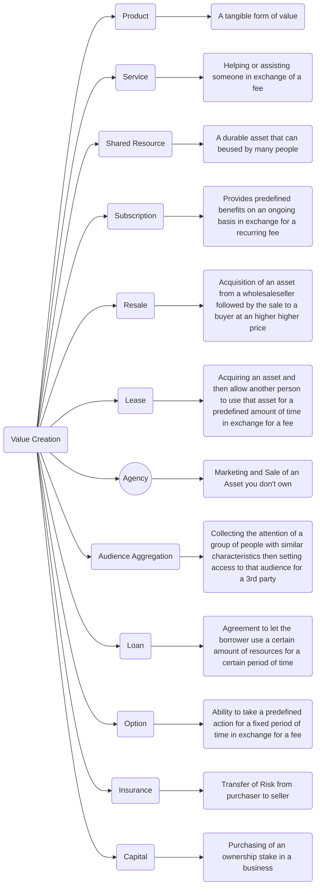
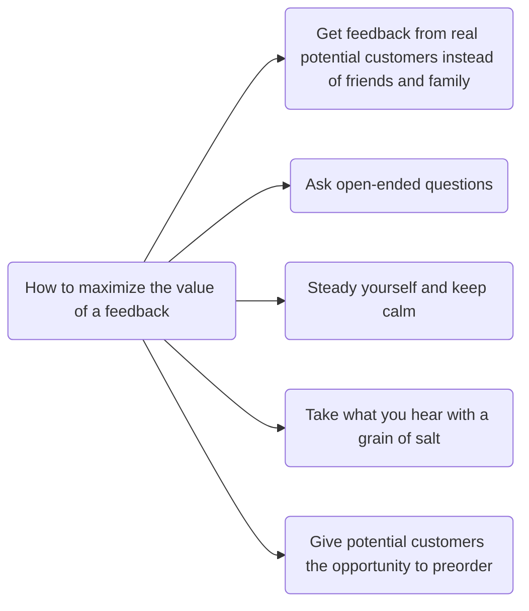
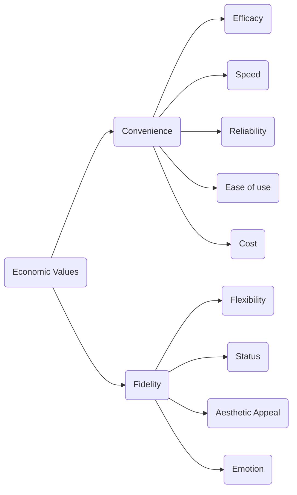

##### Josh Kaufman
## The Personal MBA
####  2020 (10th anniversary edition)

 >**Self Education is the only education there is (I. Asimov)**
#### What are the common recognized limits of Large Companies ?
1. They move slowly
2. Climbing the corporate ladder is an obstacle to doing great work
3. Frustration lead to burnout
 >**Whoever best describes the problem is the one most likely to solve it (D. Roam)**

### A succesfull business provides:
#### Something at a value that (VALUE CREATION)
#### other people want or need (MARKETING)
#### at a price they are willing to pay in a way that (SALES)
#### satisfies the customer needs and expectations so that (VALUE DELIVERY)
#### the business brings in sufficient profit to make it worthwile for the owners (FINANCE) 

 >**Make something people want. There is nothing more valuable than an unmet need that is just becoming fixable (P. Graham)**
 Without Value Creation a business can't exist ! You can't transact with others unless you have something valuable to trade.

 >**Understanding human needs is half the job of meeting them (A. Stevenson)**

#### 5 Core human drives
1. Drive to acquire
2. Drive to bond
3. Drive to learn
4. Drive to Defend
5. Drive to feel

 >**So often people are working hard at the wrong thing. Working on the right thing is probably more important than working hard (C. Fake)**

#### 10 Ways to evaluate a market
1. Urgency
2. Market Size
3. Prising Potential
4. Cost of Customer acquisition
5. Cost of value delivery
6. Uniqueness of Offer
7. Speed of Market
8. Upfront Investment
9. Upsell potential
10. Evergreen potential

 >**Value is not intrinsic; it is not in things. It is within us; it is the way in which man reacts to the conditions of his environment (L. Von Mises)**

12 ways to create value:

>**People do not trade money for things when they value their money more highly than they value the things (H. Williams)**

>**People do not trade money for things when they value their money more highly than they value the things (Van Gogh)**

**Perceived Value** determines how much your customers will be willing to pay for what you are offering.
**Bundling** allows to repurpose value that you have already created to create even more value.

Do not be shy about showing potential customers your work in progress. Ideas are cheap, what counts is the ability to translate an idea in reality. It is almost always good to get feedback from real customers.
 >**I have not failed, I have just found 10.000 ways that do not work (T. Edison)**

 >**No business plan survives the first contact with customers (S.G.Blank)**

 >**The moment that one definitely commits oneself, the providence moves to (W.H.Murray)**
 
 >**I can't give you a surefire formula for success, but I can give you a formula for failure: try to please everybody all time (H.B.Swope)**

 A **Trade Off** is a decision that places a higher value on one of several competing options.
 Paying attention to the **patterns** behind what your best customers value, you'll be able to focus on improving your offering for most of your best potential customers.
 

**Shadow Testing** consists in selling an offering before it actually exists. It is used to get feedbacks.
 **Mevo (Minimum Economically Valuable Offer)** provides the smallest number of benefits necessary to produce an actual sale.
 
  >**If you are not embarrassed by the 1st version of your product, you've launched too late (R. Hoffmann)**

Make and test changes quickly and incrementally (**Incremental Augmentation**)
Using what you make every day is the best way to improve the quality of what you are offering. Become the most demanding customer of your product.

Without marketing no business can survive. Marketing is the art of finding **prospects**: people who are actively interested in what you have to offer.

The form of your message has a big influence on how receptive people are to the information it contains.

  >**Advertising is the tax you pay for being unremarkable (R. Stephens)**
  >**People do not buy quarter inch drills, they buy quarter inch holes (T. Levitt)**

In marketing the **End Result** is what matters most, which is usually a distinctive experience or emotion related to a core human drive. If your marketing activity do not produce some visceral feelings of desire in your prospects you are wasting your time and money.
**Framing** is the act of emphasizing the details that are critically important while de-emphasizing things that aren't.
A **Hook** is a single phrase or sentence that describes an offer's primary benefit.
A **Call to Action** consists in attracting a prospect's attention.

  >**Don't make me think (S. Kurg)**
  
   >**If you want an audience start a fight (Irish Proverb)**

**Reputation** is what people generally think about a particular offer or company. 
