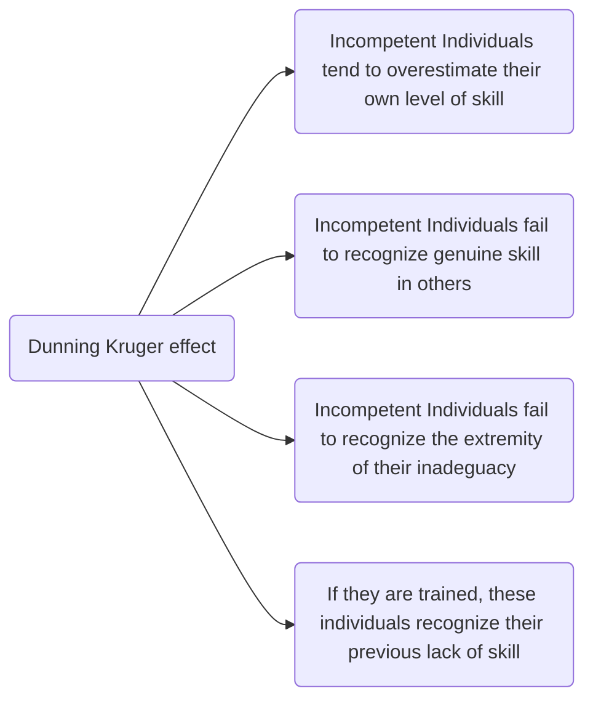
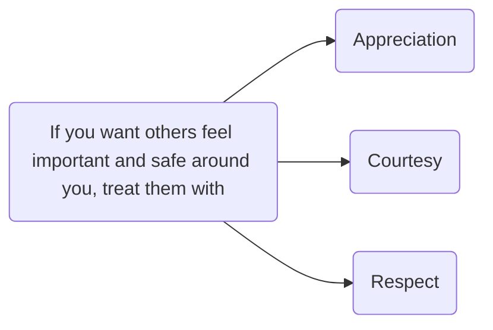

##### Josh Kaufman
## The Personal MBA
####  2020 (10th anniversary edition)

 >**Self Education is the only education there is (I. Asimov)**
#### What are the common recognized limits of Large Companies ?
1. They move slowly
2. Climbing the corporate ladder is an obstacle to doing great work
3. Frustration lead to burnout
 >**Whoever best describes the problem is the one most likely to solve it (D. Roam)**

### A succesfull business provides:
#### Something at a value that (VALUE CREATION)
#### other people want or need (MARKETING)
#### at a price they are willing to pay in a way that (SALES)
#### satisfies the customer needs and expectations so that (VALUE DELIVERY)
#### the business brings in sufficient profit to make it worthwile for the owners (FINANCE) 

 >**Make something people want. There is nothing more valuable than an unmet need that is just becoming fixable (P. Graham)**
 Without Value Creation a business can't exist ! You can't transact with others unless you have something valuable to trade.

 >**Understanding human needs is half the job of meeting them (A. Stevenson)**

#### 5 Core human drives
1. Drive to acquire
2. Drive to bond
3. Drive to learn
4. Drive to Defend
5. Drive to feel

 >**So often people are working hard at the wrong thing. Working on the right thing is probably more important than working hard (C. Fake)**

#### 10 Ways to evaluate a market
1. Urgency
2. Market Size
3. Prising Potential
4. Cost of Customer acquisition
5. Cost of value delivery
6. Uniqueness of Offer
7. Speed of Market
8. Upfront Investment
9. Upsell potential
10. Evergreen potential

 >**Value is not intrinsic; it is not in things. It is within us; it is the way in which man reacts to the conditions of his environment (L. Von Mises)**

12 ways to create value:

>**People do not trade money for things when they value their money more highly than they value the things (H. Williams)**

>**People do not trade money for things when they value their money more highly than they value the things (Van Gogh)**

**Perceived Value** determines how much your customers will be willing to pay for what you are offering.
**Bundling** allows to repurpose value that you have already created to create even more value.

Do not be shy about showing potential customers your work in progress. Ideas are cheap, what counts is the ability to translate an idea in reality. It is almost always good to get feedback from real customers.
 >**I have not failed, I have just found 10.000 ways that do not work (T. Edison)**

 >**No business plan survives the first contact with customers (S.G.Blank)**

 >**The moment that one definitely commits oneself, the providence moves to (W.H.Murray)**
 
 >**I can't give you a surefire formula for success, but I can give you a formula for failure: try to please everybody all time (H.B.Swope)**

 A **Trade Off** is a decision that places a higher value on one of several competing options.
 Paying attention to the **patterns** behind what your best customers value, you'll be able to focus on improving your offering for most of your best potential customers.
 

**Shadow Testing** consists in selling an offering before it actually exists. It is used to get feedbacks.
 **Mevo (Minimum Economically Valuable Offer)** provides the smallest number of benefits necessary to produce an actual sale.
 
  >**If you are not embarrassed by the 1st version of your product, you've launched too late (R. Hoffmann)**

Make and test changes quickly and incrementally (**Incremental Augmentation**)
Using what you make every day is the best way to improve the quality of what you are offering. Become the most demanding customer of your product.

Without marketing no business can survive. Marketing is the art of finding **prospects**: people who are actively interested in what you have to offer.

The form of your message has a big influence on how receptive people are to the information it contains.

  >**Advertising is the tax you pay for being unremarkable (R. Stephens)**
  >**People do not buy quarter inch drills, they buy quarter inch holes (T. Levitt)**

In marketing the **End Result** is what matters most, which is usually a distinctive experience or emotion related to a core human drive. If your marketing activity do not produce some visceral feelings of desire in your prospects you are wasting your time and money.
**Framing** is the act of emphasizing the details that are critically important while de-emphasizing things that aren't.
A **Hook** is a single phrase or sentence that describes an offer's primary benefit.
A **Call to Action** consists in attracting a prospect's attention.

  >**Don't make me think (S. Kurg)**
  
   >**If you want an audience start a fight (Irish Proverb)**

**Reputation** is what people generally think about a particular offer or company. 
Building your reputation takes time and effort , but is the most effective kind of marketing there is.
>**There is only one boss: the customer. And he can fire everybody in the company from the chairman on down ...  (J. Walton)**

A **Transaction** is an exchange of value between two or more parties.
>**A compromise is the art of dividing a cake in such a way that everyone believes he has the biggest piece (L. Herard)**

Common ground is a precondition of any type of transaction. Without any area of overlapping interest there is no reason for a prospect to chose to work with you. 

The **Pricing uncertainty principle** states that all prices are arbitrary.
>**Price is what you pay, value is what you get (W. Buffet)**

The 4 possible **pricing methods** are:
1. Replacement cost
2. Market Comparison
3. Discounted Cash Flow(DCF) / Net Present Value (NPV)
4. Value Comparison

**Education Based Selling** is the process of making your prospects better, more informed customers. By investing energy in making your prospects smarter, you simultaneously build trust in your expertise and make them better customers.
**Next best alternative** is what you'll do in the event you can't find a common ground with the party you are negotiating with. The more acceptable alternatives you have, the better your position.

The 3 universal alternatives are:
1. Resources
2. Time 
3. Flexibility

The 3 steps of **3D Negotiation** are:
1. Setup (Who has the power)
2. Structure (What is NBA (Next Best Alternative)
3. Discussion (Real Talk)

>**Gifts are never free: they bind the giver and the receiver in a loop of reciprocity (M. Mauss)**
Providing **free value** builds your social capital.

5 standard objections that appear in sales:
1. It costs too much (loss aversion)
2. It won't work
3. It won't work for me
4. I can wait
5. It is too difficult

**Reactivation** is the process of causing past customers to buy from you again.

>**A satisfied business customer is the best business strategy of all (M. Leboeuf)**

The longer the **process** the higher the risk of things going wrong.

The 2 possible distribution channels are:
1. Direct to User
2. Intermediary

>**Never promise more than you can perform (P. Syrus)**

Quality = Performance - Expectations

Offer Predictability is given by:
1. Uniformity
2. Consistency
3. Reliability
+ Reputation
+ Value Perception

**Throughput** (which should always be measured) represents the rate at which a system achieves its desired goal.

**Duplication** is the ability to reliably reproduce something of value.

The less human involvement required to create and deliver value, the more scalable the business.
**Tools** are important because they multiply the effect of physical force, thought or attention. Th more a tool amplifies or concentrates your effort, the more effective the tool.
>**If you can't describe what you are doing as a process, you don't know what you are doing (E. Deming)**

**Finance** is the art and science of watching the money flowing into and out of a business, then decide to allocate it and determining whether or not what you are doing is producing the results you want.
**Profit** is what allows businesses to continue to stay in operation.
>**You can have everything you want in this life if you help enough other people get what they want (Z. Ziglar)**

The higher the **Lifetime Value** of your customer, the more you can do to keep them happy. Maintain a long term relationship with profitable customers !
**Overhead** represent the minimum ongoing resources required for a business to continue operations.

>**You have to spend money to make money**

**Purchasing Power** is the sum total of all liquid assets a business has at its disposal.

**Receivable** are the promises of payment you have received from others and **Debt** is a promise you make to pay someone at a later date.
**Opportunity Cost** is the value you are giving up by making a decision.

**Absence Blindness** is the hard time human have in paying attention to what's not present.

**leverage** is the practice of using borrowed money to magnify potential gains.
**Bootstraping** is the art of building and operating a business without Funding, maintaining 100% of business operations.
**Sunk Costs** are investments of time, energy and money that can't be recovered once thay have been made.

ROI = (Net Income/Investment Cost) x 100

Hierarchy of fundings:
1. Public Stock Offering
2. Venture Capital
3. Angel Capital
4. Receivable Financing
5. Bonds
6. Secured Loans
7. Unsecured Loans
8. Personal Loans
9. Personal Credit

****
>**Every man is a quotation from all his ancestors (R.W. Emerson)**

>**Whatever an individual or a business decides  that success has been attained , progress stops(T.J.Watson)**

People are generally **lazy**, being leazy is a feature, not a bug.
Change your environment and you'll be amazed how drastically your behavior will change in response.
**Reorganization** is the random action that occurs when a reference level is violated but you don't know what to do to bring the perception back under control.
**Mental Simulation**is our minds ability to imagine taking a specific action, then simulating the probable result before acting.
**Motivation** is an emotion, not a logical rational activity.

What is **loss aversion** ? People hate to lose things more than they like to gain them.

Dunban's number (150) is a theoretical cognitive limit on the number of social relationships humans can maintain at one time. (Cognitive Scope Limitation).

The human mind stores information contextually, including cues like environment and correlation. Because the brain is a a pattern matching machine it is constantly trying to figure out what's associated with what.
**Absence Blindness** is a cognitive bias that prevent us from identifying what we can't observe. Our perceptual faculties evolved to detect objects that are present in the environment.
Our perceptual faculties are optimized to notice contrast, not to compare what we perceive with things that aren't there. **Framing** is a way to control the perception of contrast.

People typically prefer the government to act, even if the action the government takes ultimately make things worse. 

Scarcity encourages people to make decisions quickly, it is one of the things that naturally overcomes our tendency to conserve. Loss aversion ensures that this possibility feels bad enough to prompt us to take action now.

Having a list of 2 or 3 MIT (Most Important Tasks) helps you maintain a monoideal state, by giving you permission to say no to interruptions that aren't as important.
**S**et
**P**ositive
**I**mmediate
**C**oncrete
**S**pecific
**G**oals

**Emotional Experiences** aren't achievements (and shouldn't be set as achievements) because they fluctuate over time (you can be happy right now and upset an hour from now)

>**We are what we repeatedly do. Excellence then is not an cat, but a habit (W. Durant)**

Habits are regular actions that support us. Due to the power of accumulation, small habits can add up to huge results over time.
A **Decision** is the act of committing to a specific plan of action.
**Self-elicitation** is the practice of asking yourself questions then answering them. By asking yourself good questions you can grasp important insights or generate new ideas very quickly.

 >**Work expands so as to fill the time available for its completion (C.N. Parkinson)**
The more incompetent a person is, the less they realize they are incompetent. The more a person actually knows, the better their ability to self-assess their capabilities.

**Confirmation Bias** is the general tendency for people to pay attention to information that supports their conclusion and ignore information that doesn't.
****
The Elements of Power:
1. **Influence**: the ability to encourage someone else to want what you suggest.
2. **Compulsion**: the ability to force someone else to do what you command.

Power is a neutral tool (it can be used for good or ill). Power represents the ability to get things done through other people: the more power you have the more things you can do.
The best way to increase your power is to do things that increase your influence and reputation. The more people know your capabilities and respect the reputation you've built, the more power you'll have.
**Comparative advantage** means it's better to capitalize your own strengths than to show up your weaknesses.
Large companies are slow because they suffer from **communication overhead**. If you want your team to perform at its best make your team as small and autonomous as possible.
 
 >**The deepest principle in human nature is the craving to be appreciated (W. James)**

The 8 symptoms of bureaucratic breakdown (communication overhead):
1. The invisible decision
2. Unfinished Business
3. Coordination Paralysis
4. Nothing new
5. Pseudo-problems
6. Embattled Center
7. Negative deadlines
8. Input Domination

 >**Civilization advances by extending the number of operations we can perform without thinking (A.N. Whitehead)**

Over time you become more and more like those you spend time with , and less like people in other groups. **Convergence** is the tendency of group members to become more alike over time. **Divergence** is the tendency for groups to become less like other groups over time.
**Social Signals** are tangible indicators of some intangible quality that increases a person social status or group affiliation.

 >**We find comfort among them who agree with us, and growth among those who don't (F.A. Clark)**

Remind yourself to keep an open mind , and you'll enhance your ability to make wise decisions.
Let others know you expect great work from them and they'll do their best to line up with your expectations.
***
Businesses are complex systems that exists within even more complex systems: markets, industries, societies.
**Gall's law:** all complex systems that work evolved from simple systems that worked. Complex systems are full of variables and interdependencies that must be arranged just right in order to function.
An **Environment** is the structure in which a system operates.
Selection tests are ruthless: satisfy them and you'll thrive. Fail to adapt to changing conditions and you'll die.
 >**There are known knowns. These are things we know that we know. There are known unknowns: things that we know we don't know. But there are also unknown unknowns: things we don't know we don't know  (D. Rumsfeld)**

 >**It is not the strongest of the species that survives, nor the most intelligent, but the one most responsive to change  (C. Darwin)**

Because of our natural pattern matching abilities , we tend to see patterns were none exist and tend to attribute random changes to skill if they are good and misfortune if they are bad.
A dependency is an input that's required before the next stage of a process can take place. The more dependencies there are in a system, the higher the likelihood of delay or system failure

 >**The man who makes everything that leads to happiness depend upon himself, and not upon other man, has adopted the very best plan for living happily  (Plato)**

**Counterparty Risk** is the possibility that other people won't deliver what they have promised. Counterparty Risk is amplified by the planning fallacy.
>**The problem is not that there are problems. The problem is expecting otherwise and thinking that having problems is a problem  (T. Rubin)**

Theory of Normal Accidents <-> Shit happens
****

**Deconstruction** is the process of separating complex systems into the smallest possible subsystems in order to understand how things work.
 >**In God we trust … all others bring data  (M. Deming)**

**Measurement** helps us avoid **absence blindness** when analyzing a system. We have hard time seeing things that aren't present.
Without data you are blind. If you want to improve anything, you must measure it first.
 >**It is better to have an approximate answer to the right question than an exact answer to the wrong question  (J. Tukey)**

Garbage IN -> Garbage out
Useful analytical tools: Means, Medians, Modes, Midranges
**Correlation** is not **Causation**
 >**Those who cannot remember the past are condemned to repeat it  (G. Santayana)**

A **Proxy** measures one quality by measuring something else.
**Segmentation* is a technique that involves splitting a data set into well-defined sub-groups to add additional context.
**Humanization** is the process of using data to tell a story (narrative) about a real person's experience or behavior. Don't just present data: tell a story that helps people understand what's happening, and you'll find your analysis effort more useful.
***
**Refactoring** is the process of changing a system to improve efficiency without changing the output of the system.
Critical few (= Pareto law): in any complex system a minority of the inputs produce the majority of the output.

All good things are subject to **Diminishing Returns** after a certain point, having more of something can actually be detrimental.
**Automation** refers to a system or process that can operate without human interventions.
**Paradox of Automation**: the more efficient the automated system, the more crucial the contribution of the human operators, of that system.
**Standard Operating Procedure (SOP)** is a predefined process used to complete a task or resolve a common issue.
