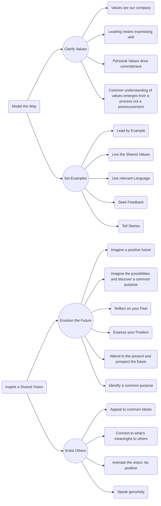
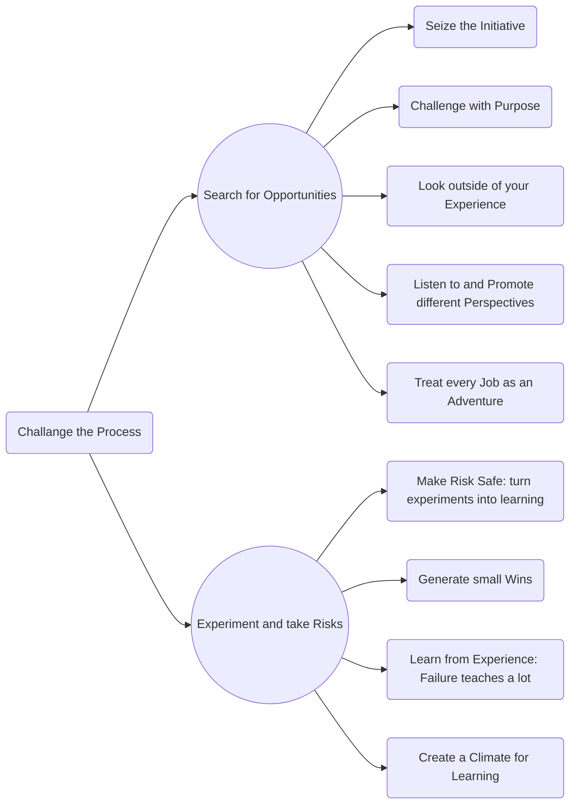
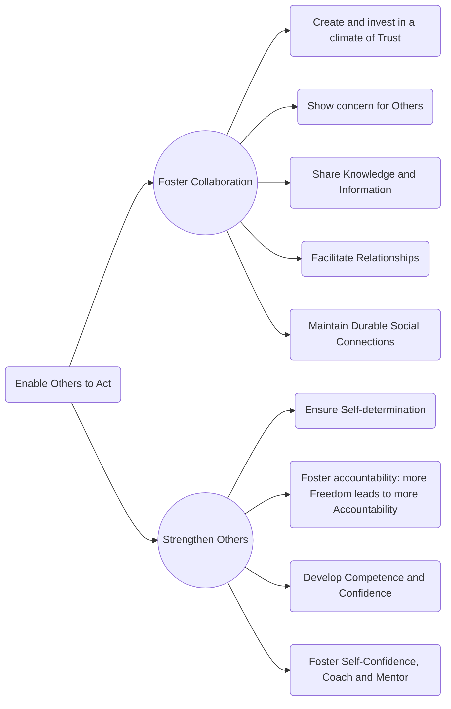
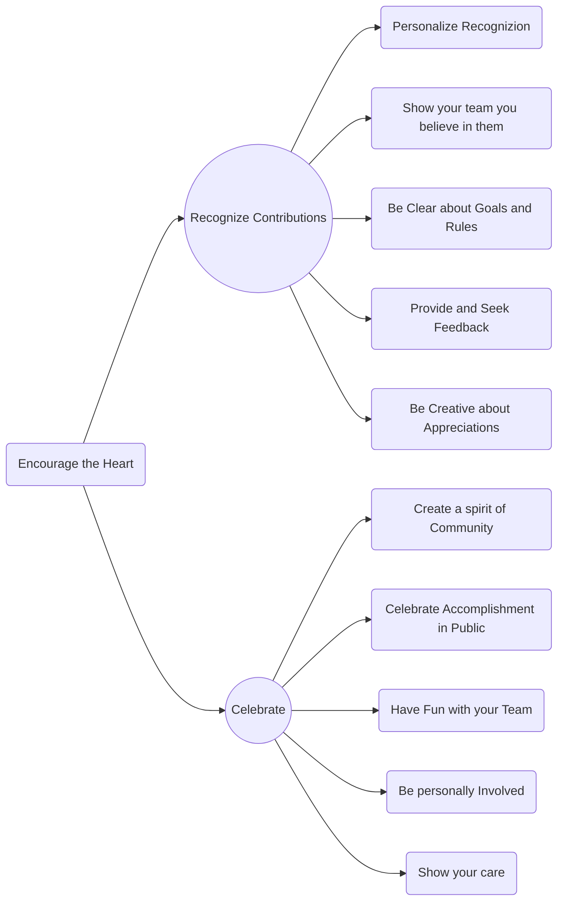

##### James M- Kouzes, Barry Z. Posner
## The Leadership Challenge 
#### 7th ed. 2023

**Challenge** is the crucible for leadership and the opportunity for greatness

> Leadership is ultimately about creating a way for people to contribute to making something extraordinary happen (A. Keith)

**Relationships** are essential for leadership. Effective leaders recognize the significance of developing relationships based on trust, respect, and open communication. Leaders inspire and encourage their team members to achieve common goals through cultivating meaningful relationships. However, leadership is more than just relationships; it entails a variety of **skills**. Communication, decision-making, problem-solving, and emotional intelligence are all important abilities for great leaders. Leaders develop these abilities in order to manage hurdles and drive collective success. **Everyone has a personal best leadership narrative**, in addition to talents and relationships. Each person's life experiences shape their leadership journey. We all have the ability to positively impact and make a difference, whether we are leading a project or mentoring others.

|Practices of Exemplary Leadership|Commitments of Exemplary Leadership  |
|--|--|
| *Model The Way* |Clarify Values |
||Set the Example
| *Inspire a Shared Vision* | Envision the Future |
||Enlist others in a common Vision
| *Challenge the Process* | Search of Opportunities |
|| Take Risks|
| *Enable Others to Act*  | Foster Collaboration  |
|| Strengthen others|
| *Encourage the Heart* | Recognize Contributions  |
||Celebrate|

The most important **characteristics of leaders** are:
 - Honesty (or integrity, or authenticity) 
 - Competence (getting things
   done) 
 - Inspiring    
 - Forward Looking

The **laws of leadership** are:
 1. `If you don't believe in the messenger you won't believe the message`
 2. `DWYSYWD` (Do What You Say You Will Do)

> The greatest Achievement of the human brain is the ability to imagine objects and episodes that do not exist in the realm of the real, and is this ability that allow us to think about the future (D. Gilbert)

> It is impossible to live without failing at something, unless you live so cautiously that you might as well not lived at all, in which case you have failed by default (J.K.Rowling)

> Leadership is not accidental or inherited, it is a deliberate thoughtful process that is about lifting the people around us (M. Harry)

