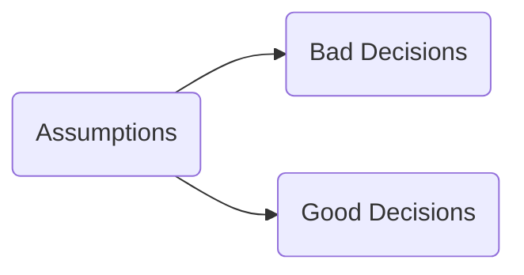
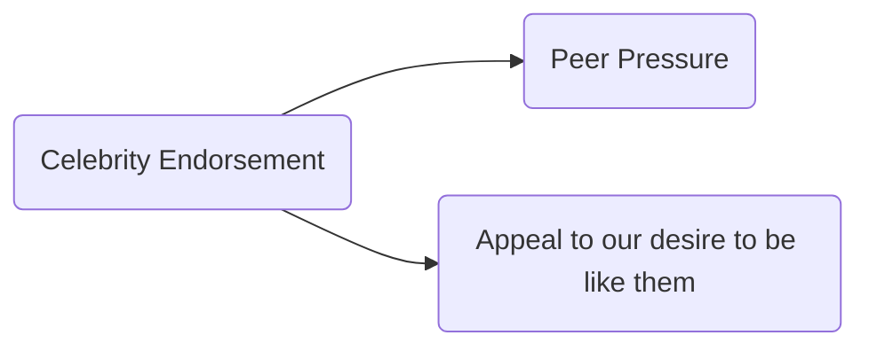
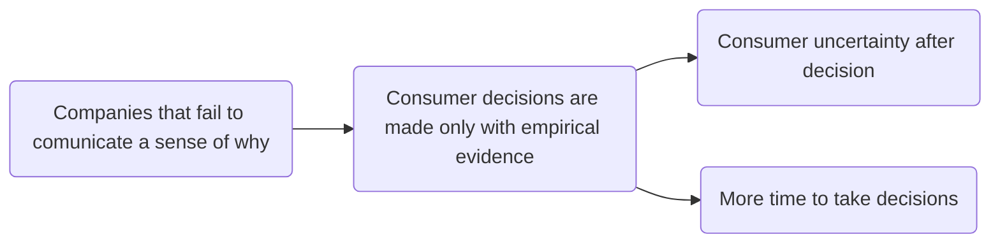

##### Simon Sinek
## Start with Why
####  

 >**We can all learn to lead (S. Sinek)**
#### We make decisions based on what we think we know.

The Golden Circle:

#### People do not buy WHAT you do, they buy WHY you do it
WHY = a belief
HOW = actions you take to realize the belief
WHAT = the results of these actions

Knowing WHY is essential for a lasting success.
No matter where we go, we trust those why whom we are able to perceive common values or beliefs (SENSE OF BELONGING)

>**If I had asked people what they wanted they would have said a faster horse (H. Ford)**

>**When we are inspired the decisions we make have more to do with who we are and less to do with the companies or the products we are buying (S. Sinek)**

**Loyalty** (when people are willing to suffer some inconvenience or pay a premium to do business with you) is a real emotional value, it exixts in the brain of the buyer, not the seller.

The goal of business is not to do business with anyone who simply wants what you have, it is to do business with people who believe what you believe.

**TRUST** is a feeling not a rational experience. It is a meanwhile thing. It allow us to rely on others. It is the bed rock for the achievement of our own lives, families, companies and species.

A company is a CULTURE ! The goal is not to hire people who simply have a skillset you need, the goal is to hire people who believe what you believe.

****When motivated by why, success just happens****

Paying someone a lot of money and asking him to come up with great ideas ensures very little -> this is an example of **manipulation**.

**Law of Diffusion**: mass-market success can only be achieved after you penetrate between 15 and 18% of the market (because the early majority won't try something new until someone else has tried it first

****Energy excites, Charisma inspires.****

**Money** is a perfectly legitimate measurement of goods sold or services rendered, but it is no calculation of value. Money is never a cause , it is always a result. Value is a perception, not a calculation, which is the reason companies make such a big deal about investing in their brand.

****Finding WHY is a process of DISCOVERY, not invention****
